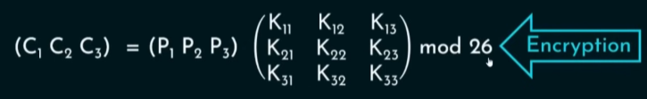
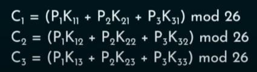
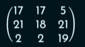
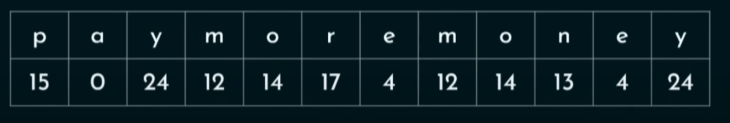

## The Hill Algorithm

-   C = E(K, P) = P x K mod 26
-   P = D(K, C) = C K^-1 mod 26 = P x K x K^-1 mod 26

-   The matrix size should be based on the plaintext size i.e. for 3 letters 3 x 3 matrix, for 4 letters 4 x 4 matrix etc.

### Encrypt "pay more money" using hill cipher

key = 

PT = pay mor emo ney

-   In case we have two letters insert dummy chr "x"

E(pay) = (17 17 11) = rrl

E(mor) = (12 22 1) = mwb

E(emo) = (10 0 18) = kas

E(ney) = (15 3 7) = pdh
